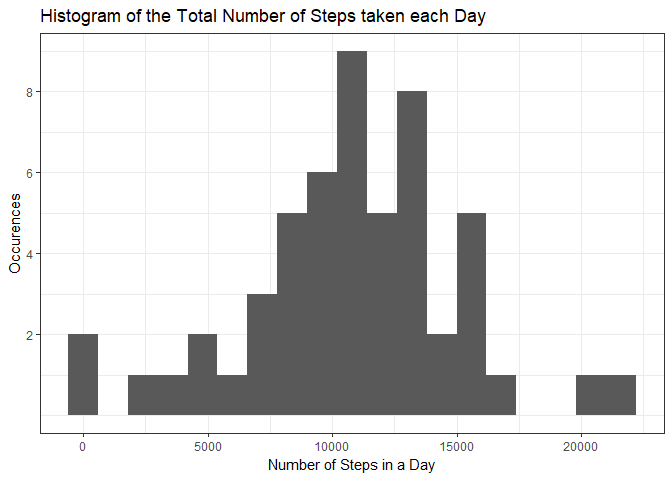
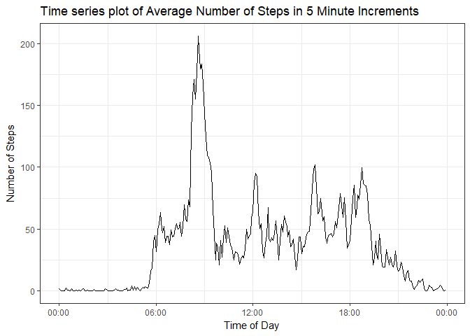
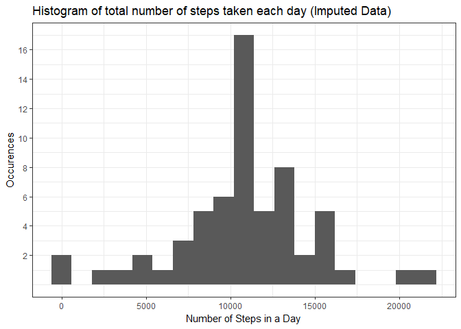
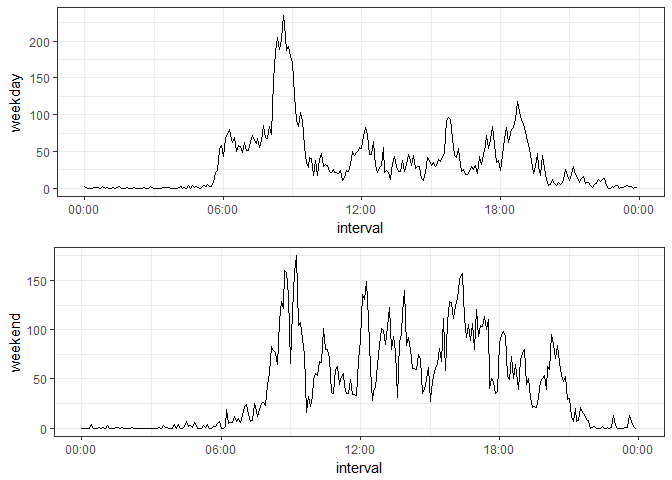

## Initialization

Load the required libraries: `lubridate` for date parsing, `dplyr` and `reshape2` to tidy the data, and `ggplot`, `gridExtra` and `scale` for some graphs.

```r
require(lubridate)
require(dplyr)
require(ggplot2)
require(reshape2)    # for dcast 
require(scales)
require(gridExtra)   # for panel plot
```


## Loading and preprocessing the data

Next Load the activity data out of the zip file provided in this directory.
We then convert steps to numeric and parse the date.


```r
activity <- read.table(unz("./activity.zip", "activity.csv"), header=TRUE, sep=",", na.strings="<NA>")


activity$steps <- as.numeric(as.character(activity$steps))
activity$date <- ymd(activity$date)
```

## What is mean total number of steps taken per day?

In order to calucate the mean total per day, we first make a new object to pull the data into a daily data frame

```r
daily <- activity %>% group_by(date) %>% summarize(steps=sum(steps))

dailyMean <- mean(daily$steps, na.rm=TRUE)
dailyMedian <- median(daily$steps, na.rm=TRUE)
```

The daily mean is 10766.2 and the daily median is 10765.


```r
ggplot(data=daily, aes(daily$steps)) + 
    geom_histogram(binwidth=1200) + 
    theme_bw() + 
    labs(x="Number of Steps in a Day", y="Occurences") +
    ggtitle("Histogram of the Total Number of Steps taken each Day") +
    scale_y_continuous(breaks=c(2,4,6,8))
```

<!-- -->


## What is the average daily activity pattern?

To identify the average daily pattern we collapse all the date to a single 24-hour period.


```r
aday <- activity %>% 
    group_by(interval) %>% 
    summarize(stepMean=mean(steps, na.rm=TRUE), stepStd=sd(steps, na.rm=TRUE))

# sets the interval to a POSIX time object
aday$intervalTime <- as.POSIXct(strptime(sprintf("%04d", aday$interval), format="%H%M", tz="UTC"))
```
Produces this view 


```r
ggplot(aday, aes(intervalTime, stepMean)) + 
    geom_line() + 
    theme_bw() + 
    labs(x="Time of Day", y="Number of Steps") +
    ggtitle("Time series plot of Average Number of Steps in 5 Minute Increments") +
    scale_x_datetime(labels=date_format("%H:%M"))
```

<!-- -->

### Which 5-minute increment is the most active?
To identify the most active time, we can filter where the daily activity shows max mean of step count.

```r
filter(aday, stepMean == max(stepMean))
```

```
## Warning: package 'bindrcpp' was built under R version 3.3.3
```

```
## # A tibble: 1 x 4
##   interval stepMean  stepStd        intervalTime
##      <int>    <dbl>    <dbl>              <dttm>
## 1      835 206.1698 292.9958 2017-11-22 08:35:00
```
This shows between 8:35A and 8:40A is the most active time interval with a little over 206 steps on average. I wonder if this indivudal uses public transportation to get to work or school each day.


## Imputing missing values

First let's check to see if there is any missing data?

```r
missingRows <- is.na(activity$steps)
sum(missingRows)
```

```
## [1] 2304
```

We will now make a new data frame called imputed for the activity data filled in 
using the mean for that increment


```r
# go ahead and use the interval mean (rounded down) to plug in 
aday$step2 <- floor(aday$stepMean)
# add the rounded step (as step2) so we can more easily replace it on the missing Rows
imputed <- merge(activity, aday[,c("interval", "step2")], by="interval") %>%
    arrange(date,interval)
missingRows <- is.na(imputed$steps)
imputed[missingRows, "steps"] <- imputed[missingRows, ]$step2
```

Now that we've filled in the missing data, let's again check the mean and median values on the imputed data


```r
dailyImputed <- imputed %>% 
    group_by(date) %>% 
    summarize(steps=sum(steps))

dailyImputedMean <- mean(dailyImputed$steps, na.rm=TRUE)
dailyImputedMedian <- median(dailyImputed$steps, na.rm=TRUE)
```

The new daily mean is 10749.8 and the updated daily median is 10641.  Note the median dropped by about 4 while the mean dropped by almost 90; this happened by ADDING some guessed number of steps for the missing data;  in fact we added a total of


```r
sum(imputed$steps, na.rm=TRUE) - sum(activity$steps, na.rm=TRUE)
```

```
## [1] 85128
```

The totals are higher, yet the averages are lower. This is because we are now averageing over all those intervals we did not have any numbers (2304 out of 17568) entries were N/A.

Let's see what that histogram looks like with the imputed daily data


```r
ggplot(data=dailyImputed, aes(dailyImputed$steps)) + 
    geom_histogram(binwidth=1200) + 
    theme_bw() + 
    labs(x="Number of Steps in a Day", y="Occurences") +
    ggtitle("Histogram of total number of steps taken each day (Imputed Data)") +
    scale_y_continuous(breaks=seq(from=2,to=20,by=2))
```

<!-- -->

Looking at this, I'm not sure this was the best choice, as it reinforces the most common data, but I think we can complete the report with this choice of filling in blank data and leave that for another discussion.

## Are there differences in activity patterns between weekdays and weekends?

To see if the weekends or weekdays show different activity patterns, let's add that factor into the daily chart.


```r
activity$dayOfWeek <- factor(weekdays(activity$date) %in% c("Saturday", "Sunday"),
                             levels=c(TRUE,FALSE), labels=c("weekend", "weekday"))
 
# add a weekday/weekend factor to the aday plot
adayWd <- activity %>% 
            group_by(interval, dayOfWeek) %>% 
            summarize(stepMean=mean(steps, na.rm=TRUE))
    
adayWd <- dcast(adayWd, interval ~ dayOfWeek, value.var = "stepMean")
adayWd$interval <- strptime(sprintf("%04d", adayWd$interval), format="%H%M", tz="UTC")
```

And Let's see a plot 


```r
g1 <- ggplot(adayWd, aes(interval)) +
        geom_line(aes(y=weekday)) +
        scale_x_datetime(labels=date_format("%H:%M")) +
        theme_bw()

g2 <- ggplot(adayWd, aes(interval)) +
    geom_line(aes(y=weekend)) +
    scale_x_datetime(labels=date_format("%H:%M")) +
    theme_bw()

grid.arrange(g1,g2,nrow=2)
```

<!-- -->
